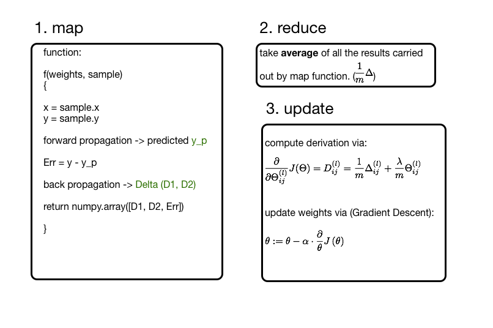

# a simple neural network on apache spark

A simple implementation of artificial neural network based on Apache Spark and python. this is another implementation of my toy program  https://github.com/lzcbetter/step-by-step-neural-network.

a virtual machine used for testing is provided by an online course https://courses.edx.org/courses/BerkeleyX/CS190.1x/1T2015/info, with which a spark environemnt has been well configured.

detailed comments about this ANN model please refer https://github.com/lzcbetter/step-by-step-neural-network

process flow chart：

todo:

1. add comments about the implementaion

2. well abstract as a class and make the model more general
